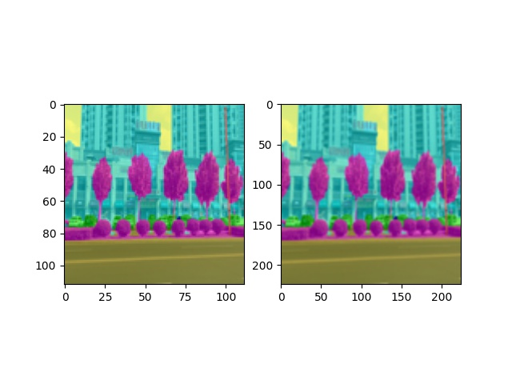

# 采用pytorch为tensorrt写插件


## 1. requirements

以下是我的测试环境，保证测试通过。
- tensorrt == 7.2.2.3
- pytorch-gpu == 1.7.0
- cuda11.1
- RTX3080

## 2. 编译

1. 修改setup.py

修改如下的tensorrt的头文件和动态的路径
```python
def trt_inc_dir():
    return "/home/darknet/CM/profile/TensorRT-7.2.2.3/include"

def trt_lib_dir():
    return "/home/darknet/CM/profile/TensorRT-7.2.2.3/lib"
```

2. 编译

```bash
python setup.py develop --plugins
```

3. 测试tensorrt内置的resize层

`python resize_test.py`

4. 测试写的插件

`python plugin_resize.py`


## 3. 结果


